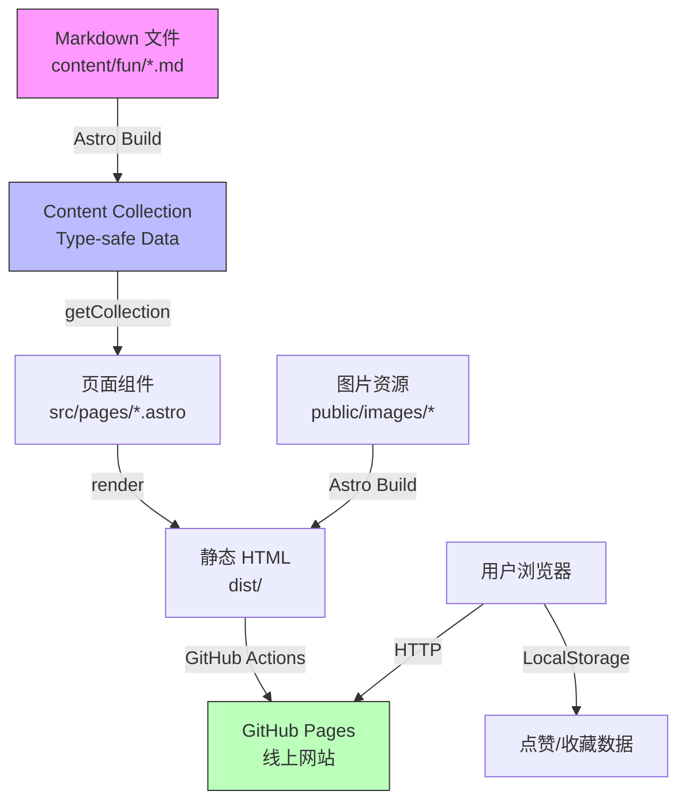
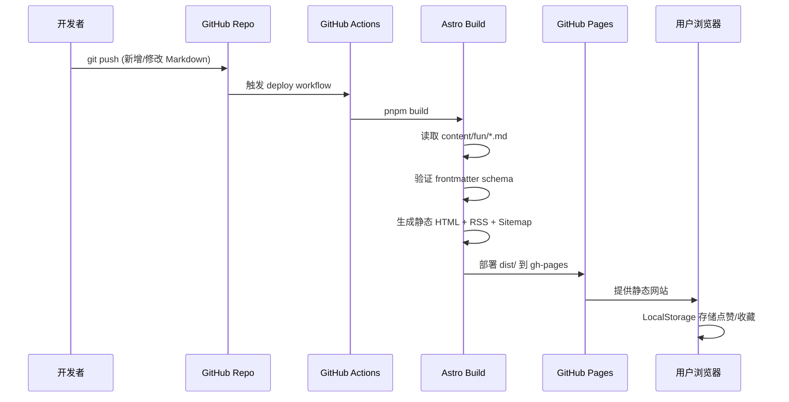
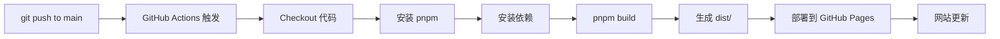

# Daily Fun — 第一阶段设计文档

> 一个适合摸鱼、放松、每天打开浏览几分钟的轻量级网站

---

## 一、技术方案分析

### 1.1 技术选型总览

| 层面 | 技术选择 | 版本 |
|------|---------|------|
| 框架 | Astro | 5.x |
| 语言 | TypeScript | 5.x |
| 样式 | Tailwind CSS | 4.x |
| 内容管理 | Astro Content Collections (Loader API) | 内置 |
| 内容格式 | Markdown (.md) | — |
| 包管理 | pnpm | 10.x |
| 代码规范 | ESLint + Prettier | — |
| 部署 | GitHub Pages | — |
| CI/CD | GitHub Actions | — |
| 图片存储 | public/images/ (本地) → Cloudflare R2 (未来) | — |

### 1.2 每项选择理由

#### Astro 5.x

**选择理由：**
- **零 JS 默认**：Astro 默认输出纯 HTML，不发送任何客户端 JS，天然满足 <100KB JS 的性能目标
- **Islands 架构**：仅在需要交互的组件（如暗黑模式切换、点赞按钮）加载 JS，其余纯静态
- **Content Collections Loader API**：Astro 5 引入的新 Loader API，可自定义内容加载器，为未来 AI 自动生成内容、Cloudflare R2 图片源等扩展提供原生支持
- **Markdown 原生支持**：Content Collections 对 Markdown 有一流支持，frontmatter schema 验证、类型安全
- **静态生成 (SSG)**：构建时生成纯 HTML，无需服务器，完美适配 GitHub Pages
- **框架无关**：未来如需 React/Vue 组件可按需引入，不影响现有代码

**不选 Next.js 的理由：**
- Next.js SSG 虽可行，但默认 JS 体积大，难以满足 <100KB JS 目标
- 框架重，对纯内容站过度设计
- Vercel 免费版国内访问不稳定

**不选 Hugo 的理由：**
- 模板语法非主流，扩展性差
- 无 TypeScript 支持
- 无组件化能力

#### TypeScript

**选择理由：**
- Content Collections schema 自动生成类型，编辑 Markdown frontmatter 时有完整类型提示
- 组件 props 类型安全
- 长期维护成本低

#### Tailwind CSS 4.x

**选择理由：**
- 原子化 CSS，构建时 tree-shake，最终 CSS 体积极小
- 暗黑模式 `dark:` 前缀一行搞定
- 响应式 `sm:/md:/lg:` 前缀原生支持
- 与 Astro 集成零配置
- 4.x 使用 CSS-first 配置，更轻量

#### pnpm

**选择理由：**
- 磁盘占用小（硬链接共享依赖）
- 安装速度快
- 严格的依赖隔离，避免幽灵依赖

#### GitHub Pages + GitHub Actions

**选择理由：**
- 完全免费，无限静态页面
- GitHub Actions 每月 2000+ 免费分钟，构建 Astro 站点每次约 1-2 分钟，绰绰有余
- push 触发自动构建部署，零运维
- 自带 HTTPS
- 支持自定义域名

---

## 二、项目目录设计

```
daily-fun/
├── .github/
│   └── workflows/
│       └── deploy.yml              # GitHub Actions 自动部署
├── content/
│   └── fun/                        # Content Collection: 所有搞笑内容
│       ├── 2026-08-01-joke-1.md
│       ├── 2026-08-01-meme-1.md
│       ├── 2026-08-02-quote-1.md
│       └── ...
├── public/
│   ├── images/                     # 图片资源（本地存储）
│   │   ├── memes/
│   │   ├── jokes/
│   │   └── quotes/
│   ├── favicon.svg
│   ├── robots.txt
│   └── manifest.json               # PWA manifest（未来）
├── src/
│   ├── components/                 # UI 组件
│   │   ├── BaseHead.astro          # <head> 公共 meta
│   │   ├── Header.astro            # 顶部导航
│   │   ├── Footer.astro            # 底部
│   │   ├── FunCard.astro           # 内容卡片（核心组件）
│   │   ├── FunFeed.astro           # 信息流容器
│   │   ├── CategoryBadge.astro     # 分类标签
│   │   ├── TagList.astro           # 标签列表
│   │   ├── ThemeToggle.astro       # 暗黑模式切换（Island）
│   │   ├── LikeButton.astro        # 点赞按钮（Island，未来）
│   │   └── Pagination.astro        # 分页（未来）
│   ├── layouts/
│   │   └── BaseLayout.astro        # 基础布局
│   ├── pages/
│   │   ├── index.astro             # 首页（信息流）
│   │   ├── latest.astro            # 最新
│   │   ├── random.astro            # 随机（未来）
│   │   ├── category/
│   │   │   └── [category].astro    # 分类页
│   │   ├── tag/
│   │   │   └── [tag].astro         # 标签页
│   │   ├── about.astro             # 关于
│   │   ├── rss.xml.ts              # RSS Feed
│   │   └── 404.astro               # 404 页面
│   ├── styles/
│   │   └── global.css              # 全局样式 + Tailwind 指令
│   ├── utils/
│   │   ├── content.ts              # 内容处理工具函数
│   │   ├── date.ts                 # 日期格式化
│   │   └── seo.ts                  # SEO meta 生成
│   └── content.config.ts           # Content Collections schema 定义
├── scripts/
│   └── add-content.ts              # 快速添加内容的 CLI 脚本
├── .eslintrc.json
├── .prettierrc.json
├── astro.config.mts
├── tailwind.config.ts              # Tailwind 4.x 可能不需要此文件
├── tsconfig.json
├── package.json
├── pnpm-lock.yaml
└── README.md
```

### 目录职责说明

| 目录 | 职责 | 备注 |
|------|------|------|
| `content/fun/` | 所有搞笑内容 Markdown | 单一 Collection，通过 frontmatter 的 category 字段区分类型 |
| `public/images/` | 图片静态资源 | 构建时原样复制，Markdown 中直接引用 |
| `src/components/` | UI 组件 | 纯展示用 `.astro`，交互用 `.tsx` (Island) |
| `src/layouts/` | 页面布局 | 包含 Head、Header、Footer 的骨架 |
| `src/pages/` | 页面路由 | Astro 基于文件的路由 |
| `src/styles/` | 全局样式 | Tailwind 指令 + 自定义 CSS 变量 |
| `src/utils/` | 工具函数 | 纯 TypeScript，无副作用 |
| `scripts/` | 辅助脚本 | 内容管理 CLI 工具 |

### 为什么用单一 Collection 而非多个？

需求中提到 `content/jokes/`、`content/memes/`、`content/quotes/` 分目录。但经过分析，**采用单一 `content/fun/` Collection + category 字段**更优：

1. **首页信息流**需要混合展示所有类型，单一 Collection 一次查询即可，多 Collection 需合并排序
2. **分类页**通过 `filter` 按 category 过滤，效果等同分目录
3. **标签跨类型**：一个 meme 可以有 "work" 标签，一个 quote 也可以，单一 Collection 标签聚合更自然
4. **未来扩展**：新增类型只需加 category 值，无需创建新目录和 schema

如果后续内容量极大（1000+），可拆分为多 Collection，但当前阶段单一更简洁。

---

## 三、页面规划

### 3.1 页面结构图

```
┌─────────────────────────────────────────────┐
│                  Header                      │
│  [Logo] Daily Fun    [最新] [分类] [关于] [🌙]│
├─────────────────────────────────────────────┤
│                                             │
│  ┌─────────────────────────────────────┐    │
│  │         FunCard (meme)              │    │
│  │  [分类标签]  2026-08-04             │    │
│  │  ┌─────────────────────────────┐    │    │
│  │  │                             │    │    │
│  │  │         图片 / GIF          │    │    │
│  │  │                             │    │    │
│  │  └─────────────────────────────┘    │    │
│  │  标题文字                           │    │
│  │  #tag1 #tag2          [❤️ 42]      │    │
│  └─────────────────────────────────────┘    │
│                                             │
│  ┌─────────────────────────────────────┐    │
│  │         FunCard (quote)             │    │
│  │  [分类标签]  2026-08-03             │    │
│  │                                     │    │
│  │  "搞笑的文字内容..."                │    │
│  │                                     │    │
│  │  #tag1 #tag2          [❤️ 12]      │    │
│  └─────────────────────────────────────┘    │
│                                             │
│  ┌─────────────────────────────────────┐    │
│  │         FunCard (joke)              │    │
│  │  ...                                │    │
│  └─────────────────────────────────────┘    │
│                                             │
│          [加载更多...]                       │
│                                             │
├─────────────────────────────────────────────┤
│                  Footer                      │
│  © 2026 Daily Fun · RSS · Sitemap           │
└─────────────────────────────────────────────┘
```

### 3.2 页面清单

| 页面 | 路由 | 功能 | 优先级 |
|------|------|------|--------|
| 首页 | `/` | 信息流，按日期倒序展示所有内容 | P0 |
| 最新 | `/latest` | 同首页，URL 语义化 | P0 |
| 分类 | `/category/[category]` | 按分类筛选 | P0 |
| 标签 | `/tag/[tag]` | 按标签筛选 | P0 |
| 关于 | `/about` | 网站介绍 | P1 |
| 404 | `/404` | 自定义 404 页面 | P1 |
| RSS | `/rss.xml` | RSS Feed | P1 |
| Sitemap | `/sitemap-index.xml` | Astro 自动生成 | P1 |
| 随机 | `/random` | 随机推荐内容 | P2 |
| 详情 | `/fun/[slug]` | 单条内容详情页 | P2 |

### 3.3 导航结构

```
Header 导航:
  Logo (Daily Fun) → 首页
  最新 → /latest
  分类 → /category (分类列表页，或下拉菜单)
  关于 → /about
  🌙/☀️ → 暗黑模式切换
```

---

## 四、数据结构设计

### 4.1 Content Collection Schema

```typescript
// src/content.config.ts
import { defineCollection, z } from 'astro:content';
import { glob } from 'astro/loaders';

const fun = defineCollection({
  loader: glob({ pattern: '**/*.md', base: './content/fun' }),
  schema: z.object({
    title: z.string(),
    date: z.coerce.date(),
    category: z.enum(['meme', 'joke', 'quote', 'gif', 'image', 'other']),
    tags: z.array(z.string()).default([]),
    image: z.string().optional(),       // 图片路径，如 /images/memes/xxx.png
    imageAlt: z.string().optional(),    // 图片 alt 文本
    description: z.string().optional(), // 简短描述，用于 SEO 和卡片预览
    source: z.string().optional(),      // 来源标注
  }),
});

export const collections = { fun };
```

### 4.2 分类 (category) 定义

| category | 中文 | 说明 | 典型内容 |
|----------|------|------|---------|
| `meme` | 梗图 | 网络热梗图片 | 表情包、meme 模板 |
| `joke` | 笑话 | 文字笑话 | 冷笑话、段子 |
| `quote` | 趣句 | 趣味短句 | 毒鸡汤、神回复 |
| `gif` | 动图 | GIF 动图 | 搞笑 GIF |
| `image` | 趣图 | 搞笑图片 | 翻车照、巧合照 |
| `other` | 其他 | 未分类 | — |

### 4.3 数据流图



### 4.4 构建时数据流详解



---

## 五、Markdown 规范设计

### 5.1 文件命名规范

```
格式: {YYYY}-{MM}-{DD}-{slug}.md
示例: 2026-08-04-programmer-meme.md
      2026-08-03-cold-joke.md
      2026-08-01-toxic-quote.md
```

**规则：**
- 日期前缀保证文件排序与时间线一致
- slug 使用小写英文 + 短横线，简短描述性
- 同一天多条内容用不同 slug 区分

### 5.2 Frontmatter 规范

#### 图片类内容示例 (meme/image/gif)

```markdown
---
title: "当产品经理说这个需求很简单"
date: 2026-08-04
category: meme
tags: [程序员, 产品经理, 需求]
image: /images/memes/simple-requirement.png
imageAlt: 程序员面对简单需求时的表情
description: "产品经理：这个需求很简单，你怎么要一周？"
source: "网络"
---

当产品经理说"这个需求很简单"的时候，程序员的内心...
```

#### 纯文字内容示例 (joke/quote)

```markdown
---
title: "世界上最遥远的距离"
date: 2026-08-03
category: joke
tags: [冷笑话, 距离]
description: "世界上最遥远的距离，是我在 if 你在 else"
---

世界上最遥远的距离，是我在 if 你在 else，虽然经常一起出现，但永远不能一起执行。
```

### 5.3 Frontmatter 字段说明

| 字段 | 类型 | 必填 | 说明 |
|------|------|------|------|
| `title` | string | 是 | 内容标题，显示在卡片和 SEO |
| `date` | date | 是 | 发布日期，用于排序 |
| `category` | enum | 是 | 分类：meme/joke/quote/gif/image/other |
| `tags` | string[] | 否 | 标签，用于筛选和 SEO |
| `image` | string | 否 | 图片路径，以 `/images/` 开头 |
| `imageAlt` | string | 否 | 图片 alt，无障碍和 SEO |
| `description` | string | 否 | 简短描述，用于卡片预览和 meta description |
| `source` | string | 否 | 内容来源标注 |

### 5.4 正文规范

- 图片类：正文可省略或写简短说明
- 文字类：正文为完整内容
- 支持 Markdown 格式（加粗、链接等）
- 不支持复杂嵌套

---

## 六、UI 风格设计

### 6.1 设计理念

> **"安静的有趣"** — 界面安静不抢戏，内容有趣才吸睛

参考 9GAG 的内容消费体验 + xkcd 的极简美学 + Bored Panda 的卡片布局，但更克制。

### 6.2 配色方案

#### Light Mode

| 用途 | 色值 | 说明 |
|------|------|------|
| 背景 | `#FAFAFA` | 微灰白，不刺眼 |
| 卡片背景 | `#FFFFFF` | 纯白 |
| 主文字 | `#1A1A1A` | 近黑 |
| 次文字 | `#6B7280` | 灰色 |
| 强调色 | `#6366F1` | Indigo-500，品牌色 |
| 强调色悬停 | `#4F46E5` | Indigo-600 |
| 分类标签背景 | `#EEF2FF` | Indigo-50 |
| 边框 | `#E5E7EB` | Gray-200 |

#### Dark Mode

| 用途 | 色值 | 说明 |
|------|------|------|
| 背景 | `#0F0F0F` | 近黑 |
| 卡片背景 | `#1A1A1A` | 深灰 |
| 主文字 | `#F5F5F5` | 近白 |
| 次文字 | `#9CA3AF` | 灰色 |
| 强调色 | `#818CF8` | Indigo-400 |
| 强调色悬停 | `#6366F1` | Indigo-500 |
| 分类标签背景 | `#1E1B4B` | Indigo-950 |
| 边框 | `#374151` | Gray-700 |

### 6.3 字体方案

```css
/* 系统字体栈，零网络请求 */
font-family: -apple-system, BlinkMacSystemFont, "Segoe UI",
  "Noto Sans SC", sans-serif;
```

- 标题：系统默认，font-weight: 700
- 正文：系统默认，font-weight: 400
- 代码/等宽：`"SF Mono", "Cascadia Code", monospace`

**不引入 Google Fonts**，避免额外网络请求和国内加载问题。

### 6.4 间距与圆角

| 属性 | 值 | 说明 |
|------|------|------|
| 卡片圆角 | `12px` (rounded-xl) | 柔和但不过圆 |
| 按钮圆角 | `8px` (rounded-lg) | — |
| 卡片间距 | `24px` (gap-6) | 大留白 |
| 卡片内边距 | `20px` (p-5) | — |
| 卡片阴影 | `0 1px 3px rgba(0,0,0,0.08)` | 极浅阴影 |
| 暗黑模式阴影 | `0 1px 3px rgba(0,0,0,0.3)` | — |

### 6.5 核心组件视觉规范

#### FunCard 卡片

```
┌──────────────────────────────────────┐
│  [meme]              2026-08-04      │  ← 分类标签 + 日期
│                                      │
│  ┌────────────────────────────────┐  │
│  │                                │  │
│  │         图片 (16:9 或原比例)    │  │  ← 懒加载，圆角 8px
│  │                                │  │
│  └────────────────────────────────┘  │
│                                      │
│  标题文字 (text-lg, font-bold)       │  ← 标题
│                                      │
│  正文预览 (text-sm, text-gray-500)   │  ← 正文（如有）
│                                      │
│  #tag1  #tag2  #tag3    [❤️ 42]     │  ← 标签 + 点赞
└──────────────────────────────────────┘
```

#### 纯文字卡片 (joke/quote)

```
┌──────────────────────────────────────┐
│  [joke]              2026-08-03      │
│                                      │
│  "搞笑的文字内容..."                  │  ← 大字号引用样式
│                                      │
│  #tag1  #tag2            [❤️ 12]     │
└──────────────────────────────────────┘
```

### 6.6 响应式断点

| 断点 | 宽度 | 布局 |
|------|------|------|
| 移动端 | < 640px | 单列，卡片全宽 |
| 平板 | 640-1024px | 单列，卡片最大 640px 居中 |
| 桌面 | > 1024px | 单列，卡片最大 720px 居中 |

**刻意选择单列布局**，而非多列瀑布流。原因：
- 模仿社交媒体信息流的"缓慢浏览"体验
- 单列更聚焦，适合"摸鱼"场景
- 移动端体验一致
- 实现简单，无需 Masonry JS 库

---

## 七、架构图

### 7.1 系统架构

```mermaid
graph TB
    subgraph "内容层"
        MD[Markdown 文件<br/>content/fun/*.md]
        IMG[图片资源<br/>public/images/*]
    end

    subgraph "构建层 (Astro)"
        CC[Content Collections<br/>Schema 验证 + 类型生成]
        LAYOUT[Layouts<br/>BaseLayout]
        COMP[Components<br/>FunCard / Header / ...]
        PAGES[Pages<br/>路由 + 数据获取]
        SSG[SSG 生成器<br/>静态 HTML]
    end

    subgraph "输出层"
        HTML[静态 HTML]
        CSS[CSS (Tailwind)]
        JS[极少量 JS<br/>暗黑模式/点赞]
        RSS[RSS XML]
        SITEMAP[Sitemap XML]
    end

    subgraph "部署层"
        GHA[GitHub Actions<br/>CI/CD]
        GHP[GitHub Pages<br/>静态托管]
    end

    subgraph "客户端"
        BROWSER[用户浏览器]
        LS[LocalStorage<br/>点赞/收藏]
    end

    MD --> CC
    CC --> PAGES
    IMG --> SSG
    LAYOUT --> PAGES
    COMP --> PAGES
    PAGES --> SSG
    SSG --> HTML
    SSG --> CSS
    SSG --> JS
    SSG --> RSS
    SSG --> SITEMAP
    HTML --> GHA
    CSS --> GHA
    JS --> GHA
    RSS --> GHA
    SITEMAP --> GHA
    GHA --> GHP
    GHP --> BROWSER
    BROWSER --> LS
```

### 7.2 组件架构

```mermaid
graph TD
    BL[BaseLayout.astro] --> BH[BaseHead.astro]
    BL --> HD[Header.astro]
    BL --> FT[Footer.astro]
    BL --> SLOT[<slot /> 页面内容]

    HD --> TT[ThemeToggle.tsx<br/>Island - 暗黑模式]

    IDX[index.astro 首页] --> FF[FunFeed.astro]
    FF --> FC[FunCard.astro]
    FC --> CB[CategoryBadge.astro]
    FC --> TL[TagList.astro]
    FC --> LB[LikeButton.tsx<br/>Island - 点赞]

    CAT[category/[category].astro] --> FF
    TAG[tag/[tag].astro] --> FF
    LATEST[latest.astro] --> FF
```

---

## 八、GitHub Pages 部署方案

### 8.1 部署架构



### 8.2 GitHub Actions Workflow

```yaml
# .github/workflows/deploy.yml
name: Deploy to GitHub Pages

on:
  push:
    branches: [main]
  workflow_dispatch:

permissions:
  contents: read
  pages: write
  id-token: write

concurrency:
  group: pages
  cancel-in-progress: false

jobs:
  build:
    runs-on: ubuntu-latest
    steps:
      - name: Checkout
        uses: actions/checkout@v4

      - name: Setup pnpm
        uses: pnpm/action-setup@v4
        with:
          version: 10

      - name: Setup Node
        uses: actions/setup-node@v4
        with:
          node-version: 22
          cache: pnpm

      - name: Install dependencies
        run: pnpm install --frozen-lockfile

      - name: Build
        run: pnpm build

      - name: Upload artifact
        uses: actions/upload-pages-artifact@v3
        with:
          path: dist

  deploy:
    environment:
      name: github-pages
      url: ${{ steps.deployment.outputs.page_url }}
    runs-on: ubuntu-latest
    needs: build
    steps:
      - name: Deploy to GitHub Pages
        id: deployment
        uses: actions/deploy-pages@v4
```

### 8.3 Astro 配置

```typescript
// astro.config.mts
import { defineConfig } from 'astro/config';
import tailwindcss from '@tailwindcss/vite';
import sitemap from '@astrojs/sitemap';

export default defineConfig({
  site: 'https://<username>.github.io',
  base: '/daily-fun',  // 如果用项目名子路径，如不需要可删除
  output: 'static',
  integrations: [sitemap()],
  vite: {
    plugins: [tailwindcss()],
  },
});
```

### 8.4 部署注意事项

1. **GitHub Pages 设置**：Repo Settings → Pages → Source 选择 "GitHub Actions"
2. **base 路径**：如果使用 `<username>.github.io/daily-fun/` 形式，需设置 `base: '/daily-fun'`；如果使用自定义域名或 `<username>.github.io` 根域名，则不需要
3. **图片路径**：`public/images/` 中的图片构建后位于 `/images/`（或 `/daily-fun/images/`），Markdown 中引用需与 base 路径一致

---

## 九、后续开发路线图

### Phase 1 — 项目骨架（预计 1-2 天）

**目标：** 可运行的空壳网站，部署上线

- [ ] 初始化 Astro 项目 (pnpm create astro)
- [ ] 配置 TypeScript / ESLint / Prettier
- [ ] 配置 Tailwind CSS 4.x
- [ ] 创建 BaseLayout + BaseHead + Header + Footer
- [ ] 创建 content.config.ts (Content Collection schema)
- [ ] 添加 3-5 条示例 Markdown 内容
- [ ] 实现首页信息流 (FunCard + FunFeed)
- [ ] 实现暗黑模式切换 (ThemeToggle Island)
- [ ] 配置 GitHub Actions deploy.yml
- [ ] 首次部署到 GitHub Pages
- [ ] Lighthouse 基线测试

**交付物：** 可访问的线上网站，有示例内容，暗黑模式可用

---

### Phase 2 — 核心页面（预计 1-2 天）

**目标：** 完成所有 P0/P1 页面

- [ ] 最新页 `/latest`
- [ ] 分类页 `/category/[category]`
- [ ] 分类列表页 `/category`（展示所有分类）
- [ ] 标签页 `/tag/[tag]`
- [ ] 关于页 `/about`
- [ ] 404 页面
- [ ] RSS Feed `/rss.xml`
- [ ] Sitemap（Astro 自动生成，确认可用）
- [ ] SEO meta 完善 (title / description / OG / Twitter Card)
- [ ] 图片懒加载 (loading="lazy")
- [ ] 补充更多示例内容（10-20 条）

**交付物：** 完整的页面体系，SEO 就绪

---

### Phase 3 — 性能与体验优化（预计 1 天）

**目标：** Lighthouse 四项 ≥ 95

- [ ] Lighthouse 审计 + 修复
- [ ] 图片优化（Astro Image 组件，WebP 转换）
- [ ] CSS 体积优化
- [ ] JS 体积审计（确保 < 100KB）
- [ ] 无障碍 (a11y) 修复
- [ ] 移动端体验微调
- [ ] 字体加载优化
- [ ] 预加载关键资源

**交付物：** Lighthouse 四项 ≥ 95 的报告

---

### Phase 4 — 交互增强（预计 1-2 天）

**目标：** 点赞、收藏、随机推荐

- [ ] 点赞功能 (LikeButton Island + LocalStorage)
- [ ] 收藏功能 (LocalStorage)
- [ ] 随机推荐页 `/random`
- [ ] 内容详情页 `/fun/[slug]`
- [ ] "加载更多" 分页（静态分页，非无限滚动）
- [ ] 回到顶部按钮

**交付物：** 可交互的完整体验

---

### Phase 5 — 搜索与 PWA（预计 1-2 天）

**目标：** 离线可用 + 站内搜索

- [ ] PWA manifest + Service Worker
- [ ] 站内搜索（Pagefind 集成，静态搜索，零服务器）
- [ ] 添加到主屏幕支持
- [ ] 离线缓存策略

**交付物：** 可安装的 PWA，支持搜索

---

### Phase 6 — 内容管理工具（预计 1 天）

**目标：** 降低内容追加门槛

- [ ] `scripts/add-content.ts` CLI 工具
  - 交互式输入 title/category/tags/image
  - 自动生成日期前缀文件名
  - 自动打开编辑器
  - 自动 git add + commit
- [ ] 内容模板文件
- [ ] README 内容贡献指南

**交付物：** 一条命令添加新内容

---

### Phase 7 — 高级扩展（按需）

**目标：** 面向未来的扩展能力

- [ ] Cloudflare R2 图片存储迁移
- [ ] Cloudflare Workers API（随机推荐 API、搜索 API）
- [ ] AI 自动生成内容（GitHub Actions 定时任务 + AI API）
- [ ] 每日自动发布（GitHub Actions cron + 内容队列）
- [ ] 访问统计（Cloudflare Web Analytics，免费）
- [ ] 自定义域名配置
- [ ] OG 图片自动生成（satori + vercel/og 风格，构建时生成）

---

## 十、风险与对策

| 风险 | 影响 | 对策 |
|------|------|------|
| GitHub Pages 国内访问慢 | 用户体验差 | 未来可切换 Cloudflare Pages，代码零改动 |
| 图片仓库体积膨胀 | 构建变慢 | 迁移 Cloudflare R2，Markdown 只改路径 |
| Content Collection 构建慢 | CI 时间长 | 分页构建，或拆分 Collection |
| Tailwind 4.x 生态不成熟 | 配置问题 | 降级 3.x，API 差异小 |
| GitHub Actions 免费额度用尽 | 无法部署 | 个人账号 2000 分钟/月，Astro 构建约 1-2 分钟，需 1000+ 次推送才超限 |

---

## 十一、技术决策记录 (ADR)

### ADR-001: 单一 Content Collection vs 多 Collection

**决策：** 采用单一 `content/fun/` Collection + category 字段

**理由：** 首页信息流需混合展示，单一 Collection 查询更高效；标签跨类型聚合更自然；扩展新类型只需加 category 值

### ADR-002: 单列布局 vs 瀑布流

**决策：** 单列居中布局，最大宽度 720px

**理由：** 模仿社交媒体信息流体验，适合"缓慢浏览"定位；移动端体验一致；无需 Masonry JS 库，减少 JS 体积

### ADR-003: 系统字体 vs Google Fonts

**决策：** 使用系统字体栈

**理由：** 零网络请求；国内 Google Fonts 加载不稳定；内容站对字体要求不高

### ADR-004: 静态分页 vs 无限滚动

**决策：** Phase 1-3 使用静态分页，Phase 4 考虑"加载更多"

**理由：** 纯静态站点无限滚动需客户端 JS 加载 JSON；静态分页 SEO 友好；"加载更多"是折中方案

### ADR-005: pnpm vs npm

**决策：** 使用 pnpm

**理由：** 磁盘占用小；安装快；CI 中同样可用；Astro 官方支持

---

*第一阶段设计文档完成。等待确认后进入 Phase 1 开发。*
